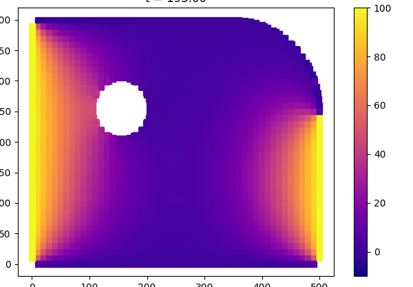

# САПР "Пластинка"

## О системе

Система может рассчитать пластину на теплопроводность одним из следующих методов:

- МКР с неявной схемой (с матрицей общего вида)
- МКР с неявной схемой и методом расслоения (с трёхдиагональной матрицей)
- МКР с явной схемой

## Описание методов решения

### Разностный аналог для неравномерной сетки

$$
\frac{\partial^2v}{\partial x^2}=2\frac{\mu v_C - (\mu +1)v_B + v_A}{\mu (\mu +1)\Delta x^2}
$$
